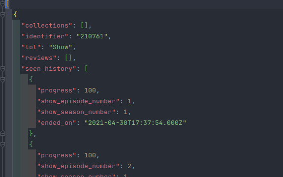
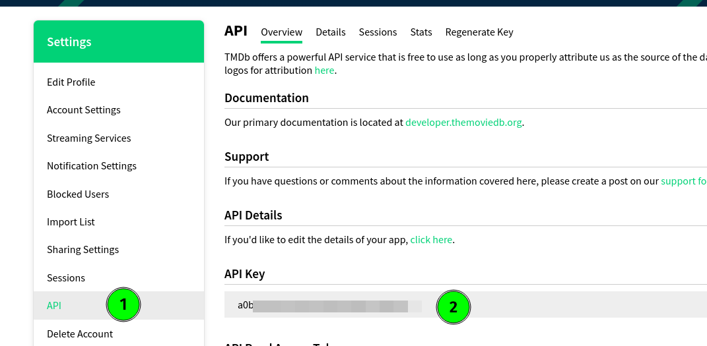
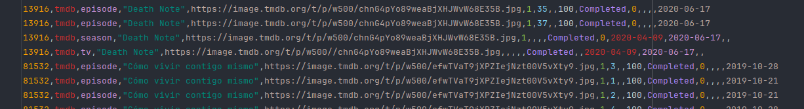
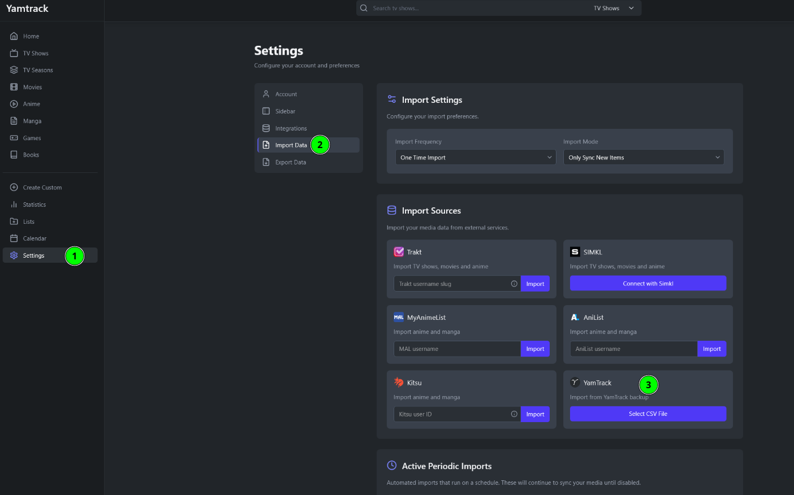

# Ryot to YamTrack

## Information

This is a personal project, that could be interesting for other people in the same situation as I was.

I used [Ryot](https://github.com/IgnisDa/ryot) for some time but after I discover [YamTrack](https://github.com/FuzzyGrim/Yamtrack) and tried I wanted to move my TV Shows data.

So this is a small script to automatize the export of my ratings from [Ryot](https://github.com/IgnisDa/ryot) and generate a CSV with following the Ryot's specification to import them into [YamTrack](https://github.com/FuzzyGrim/Yamtrack).

> Run this script and import the data on you own risk, I recommend try it first on an empty instance of Yamtrack to avoid data loses, or at least make some backups if you have some previous data.

## Requirements

- You need an export from Ryot.
- You need an api key from [The Movie Database](https://www.themoviedb.org/) in order to get some data need on YamTrack.
- You need an instance of [YamTrack](https://github.com/FuzzyGrim/Yamtrack)

### Get your Data from Ryot

You can follow the documentation of Ryot to export your data https://docs.ryot.io/exporting.html

### Work on it!

When you get your JSON with your data, you will need to take only two files into account.

You need to import these files in the same place that you have the `ryot-to-yamtrack.js file.

Here is a small example of the content of the Ryot JSON export file.

> Ryot export file example

>

## Usage

There are a couple of parameters that you need to set before running the script, you can find them in the `ryot-to-yamtrack.js` file.

- `ryot_json`: here you need to put the name of the file that contains your Ryot export, in my case is `ryot_export.json`, but you can change it if you want.
- `tmdb_api_key`: here you need to take the api key from your profile in the movie database.

## Run

To run the script, just be sure that you have node installed on your computer, at least Node 18.*

`npm install`

`node ryot-to-yamtrack.js`

While the script is running you get some information about the process of importing data.

## Import to YamTrack

Finally, when all the process finish, you should have a file named `results.csv`, that looks something like that.

After this you should just import this file into your Yamtrack instance.

Navigate in your browser to YamTrack, and click on **_Settings_**, select **_Import Data_**, and **_the file as YamTrack_**, press **_import_** and wait a bit, and everything should be fine.

